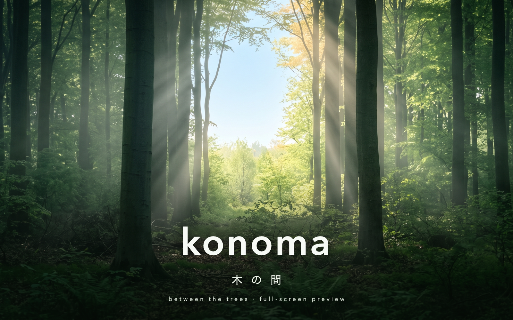
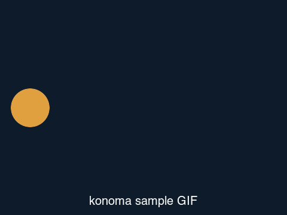

# Inline images (Markdown & HTML)

konoma renders block-level images inline, in the flow of the document (kitty
graphics). Local images and remote (`http(s)://`) images both work — remote
ones download off-thread and show a "loading" line until they arrive. Images
scroll with the text.

## Markdown ``

Text between the two images, so you can see the spacing and scrolling behavior.

## HTML `` (the same form the README uses)

## Animated GIF

Inline GIFs cycle in place, the same way the full-screen preview animates them:

## Remote images (fetched with the system `curl`, cached on disk)

A remote raster screenshot and an SVG badge — the kind READMEs show on GitHub.
Both are downloaded in the background and rendered inline (SVG is rasterized):

## Images in a table cell

A table cell holds a real image too, in both kinds of table. The cell reserves a rectangle sized
to its own column, so the picture lands inside the box drawing rather than beside it:

| Format | Sample |
|--------|--------|
| JPEG   |  |
| SVG    |  |

The same thing written as an HTML `<table>` — the screenshot-grid form, pictures on top and a
caption row underneath, which is how this repository's own README lays out its screenshots:

<table>
  <tr>
    <td></td>
    <td></td>
  </tr>
  <tr>
    <td align="center"><b>JPEG</b> — decoded to pixels</td>
    <td align="center"><b>SVG</b> — rasterized by resvg</td>
  </tr>
</table>

A remote image works in a cell as well, downloaded off-thread like any other:

| Source | Badge |
|--------|-------|
| shields.io |  |

## Safe fallbacks (design principle #3)

An unreachable remote URL and a missing local file degrade to a text
placeholder instead of breaking the preview:

End of demo.
