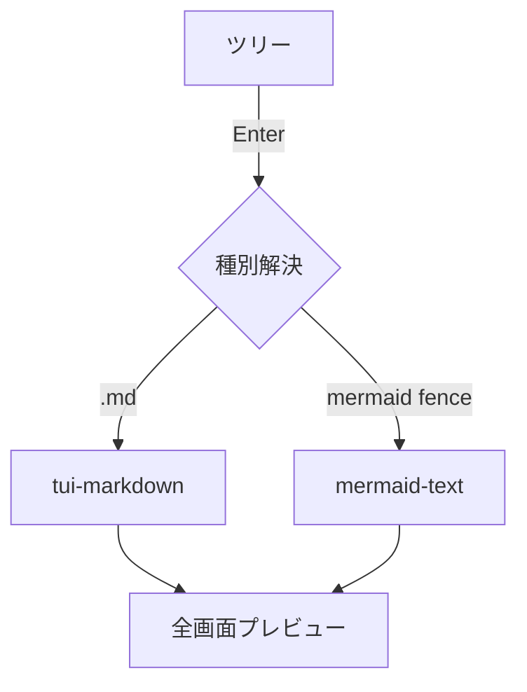

# konoma M3 デモ: Markdown 装飾

これは **太字** と *斜体* と `inline code`、そして [リンク](https://example.com) の例です。

## リスト

- 箇条書き1
- 箇条書き2
  - ネスト
1. 番号付き1
2. 番号付き2

## 引用とコード

> 引用ブロック。lightline 的な軽量プレビューでも装飾が効くことを確認する。

```rust
fn main() {
    let msg = "syntect ハイライトが効くはず";
    println!("{msg}");
}
```

## 表

| 種別 | ライブラリ | 依存 |
|------|------------|------|
| md   | tui-markdown | ratatui-core |
| 図   | mermaid-text | unicode-width |

## Mermaid（md 内フェンス→図に合成）



終わり。長い段落の折返し確認用にダミーテキストを続けます。あいうえおかきくけこさしすせそたちつてとなにぬねのはひふへほまみむめもやゆよらりるれろわをん。
