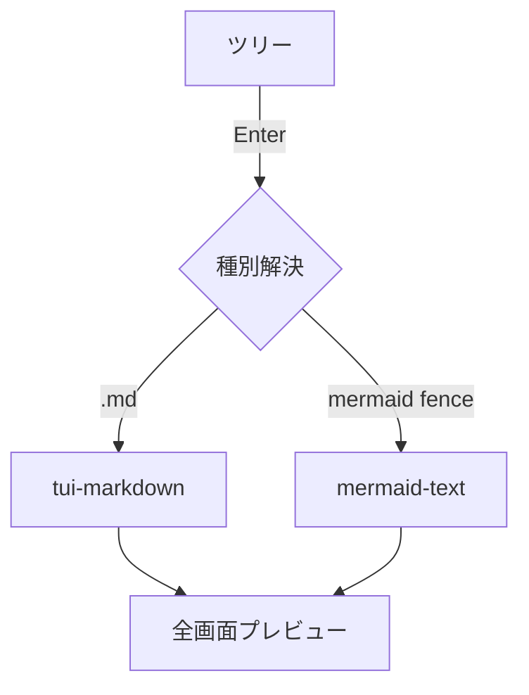

# Markdown プレビューのデモ

これは **太字** と *斜体* と `inline code`、そして [リンク](https://example.com) の例です。

## リスト

- 箇条書き1
- 箇条書き2
  - ネスト
1. 番号付き1
2. 番号付き2

## 引用とコード

> 引用ブロック。lightline 的な軽量プレビューでも装飾が効くことを確認する。

```rust
fn main() {
    let msg = "syntect ハイライトが効くはず";
    println!("{msg}");
}
```

## 表

| 種別 | ライブラリ | 依存 |
|------|------------|------|
| md   | tui-markdown | ratatui-core |
| 図   | mermaid-text | unicode-width |

### 表のインライン装飾・整列・エスケープ

`:---:`=中央 / `---:`=右寄せ、セル内の装飾記法、`\|`=リテラルの縦棒。

| 左寄せ | 中央 | 右寄せ |
|:-------|:----:|-------:|
| **太字** | *斜体* | `code` |
| ~~打消し~~ | a \| b | 123 |

## 水平線とタスクリスト

水平線（`---`）は全幅の罫線になる:

---

- [ ] 未完了タスク（☐ で表示）
- [x] 完了タスク（☑ で表示）

## HTML ブロック

<details>
<summary>details の要約行</summary>
折りたたみの中身もタグを除いたテキストとして表示される（黙って消えない）。
</details>

<!-- この HTML コメントは表示されない -->

## Mermaid（md 内フェンス→図に合成）



終わり。長い段落の折返し確認用にダミーテキストを続けます。あいうえおかきくけこさしすせそたちつてとなにぬねのはひふへほまみむめもやゆよらりるれろわをん。
