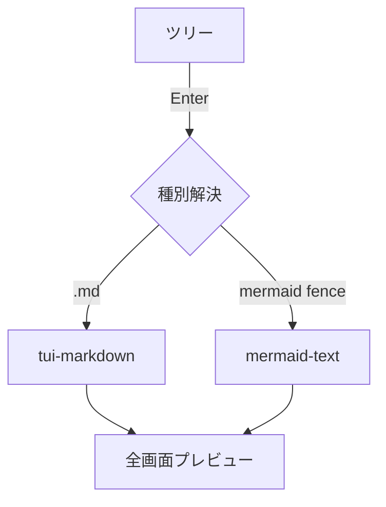

# Markdown プレビューのデモ

これは **太字** と *斜体* と `inline code`、そして [リンク](https://example.com) の例です。

## リスト

- 箇条書き1
- 箇条書き2
  - ネスト
1. 番号付き1
2. 番号付き2

## 引用とコード

> 引用ブロック。lightline 的な軽量プレビューでも装飾が効くことを確認する。

```rust
fn main() {
    let msg = "syntect ハイライトが効くはず";
    println!("{msg}");
}
```

## 表

| 種別 | ライブラリ | 依存 |
|------|------------|------|
| md   | tui-markdown | ratatui-core |
| 図   | mermaid-text | unicode-width |

### 表のインライン装飾・整列・エスケープ

`:---:`=中央 / `---:`=右寄せ、セル内の装飾記法、`\|`=リテラルの縦棒。

| 左寄せ | 中央 | 右寄せ |
|:-------|:----:|-------:|
| **太字** | *斜体* | `code` |
| ~~打消し~~ | a \| b | 123 |

## 水平線とタスクリスト

水平線（`---`）は全幅の罫線になる:

---

- [ ] 未完了タスク（Nerd Font のチェックボックスアイコンで表示。`ui.icons = false` なら `[ ]`）
- [x] 完了タスク（同・チェック済みアイコン。`ui.icons = false` なら `[x]`）

チェックボックスは操作できる: `Tab` でフォーカス（リンクと同じ巡回）→ `Space` か `Enter` で
トグル＝このファイルに書き戻る。`[ui] md_task_states` で `[" ", "/", "x"]` のような
カスタム状態の巡回もできる（`[/]` のままブラケット表示）。

## HTML ブロック

<details>
<summary>details の要約行</summary>
折りたたみの中身もタグを除いたテキストとして表示される（黙って消えない）。
</details>

<!-- この HTML コメントは表示されない -->

## アラート（GitHub 形式）

`> [!TYPE]` の引用は、色付きコールアウト箱（アイコン＋ラベル）で描かれる（`[ui] md_alerts`）。

> [!NOTE]
> 補足情報。裸 URL も自動リンク化される: https://github.com/LESIM-Co-Ltd/konoma

> [!TIP] 独自タイトル
> ヒント。本文の中では **装飾** も [リンク](images.md) も普通に効く。

> [!WARNING]
> 5種類 — NOTE / TIP / IMPORTANT / WARNING / CAUTION（別名も一部対応）。

## 自動リンクと絵文字

裸の URL・メールは自動でリンクになる（`[ui] md_autolink`）: https://example.com や www.rust-lang.org 、
メール foo@example.com 。ショートコード絵文字も変換される（`[ui] md_emoji`）: :rocket: :sparkles: :+1: 。
どちらも `インラインコード` や コードブロック内ではそのまま（GitHub と同じ）。

## ページ内リンク・脚注・インライン HTML

見出しへのリンクはその位置までスクロールする（既定 ON）: [Mermaid の節へ](#mermaidmd-内フェンス図に合成)。
（GitHub と同じ slug 規則。CJK 見出しもアンカーになる。）

脚注（`[ui] md_footnotes`）: 参照は上付き番号になり[^demo]、定義は末尾の脚注節にまとまる。

インライン HTML（`[ui] md_inline_html`）: <kbd>Ctrl</kbd>+<kbd>C</kbd> でコピー、H<sub>2</sub>O、
x<sup>2</sup>、<del>非推奨</del> は打消し線。<br>で改行も効く。

[^demo]: これが脚注の定義。文書のどこに書いてもよい。

## 画像（インライン表示）

行単位（画像だけの行）の `` は、文書の流れの中に**実ピクセルで**描画される
（kitty graphics）。画像はテキストと一緒にスクロールする。ローカル画像もリモート
（`http(s)://`）画像も表示でき、リモートは裏で取得して届くまで「loading」行を出す。


リモート画像・SVG バッジ・取得失敗時のテキスト降格まで含む網羅デモは
[`images.md`](images.md) にある。

## Mermaid（md 内フェンス→図に合成）



終わり。長い段落の折返し確認用にダミーテキストを続けます。あいうえおかきくけこさしすせそたちつてとなにぬねのはひふへほまみむめもやゆよらりるれろわをん。
