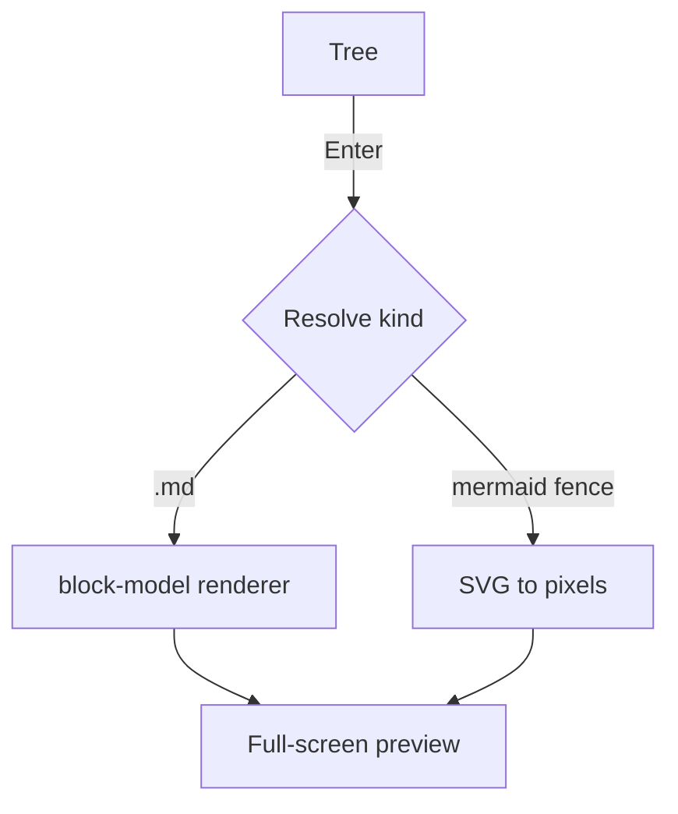

# Markdown preview demo

This shows **bold**, *italic*, `inline code`, and a [link](https://example.com).

## Lists

- Bullet 1
- Bullet 2
  - Nested
1. Numbered 1
2. Numbered 2

## Quotes and code

> A blockquote. Styling works even in a lightweight preview.

```rust
fn main() {
    let msg = "syntect highlighting should work";
    println!("{msg}");
}
```

## Tables

| Kind | Library | Depends on |
|------|---------|------------|
| md   | konoma (block model) | pulldown-cmark |
| diagram | mermaid-rs-renderer | fontdb |

### Inline styling, alignment, and escapes in tables

`:---:` = center / `---:` = right-align, inline styling inside cells, `\|` = a literal pipe.

| Left | Center | Right |
|:-----|:------:|------:|
| **bold** | *italic* | `code` |
| ~~strike~~ | a \| b | 123 |

### HTML tables

A `<table>` written as HTML is drawn as a real table too. READMEs reach for this form because a
GFM `|` table cannot put a caption row underneath a row of images. Alignment is read per cell
(`align="center"`), a `<th>` row becomes a header, and `<b>`/`<i>`/`<code>`/`<a>` inside a cell
are styled.

<table>
  <tr>
    <th>Stage</th>
    <th align="center">Output</th>
  </tr>
  <tr>
    <td><b>block model</b></td>
    <td align="center">styled spans</td>
  </tr>
  <tr>
    <td><code>mermaid-rs-renderer</code></td>
    <td align="center">SVG to pixels</td>
  </tr>
</table>

Not modeled: `colspan`/`rowspan`, a nested `<table>`, and `<caption>`.

### Images in table cells

A cell can hold an image, drawn in real pixels rather than an `🖼 alt` label. In a GFM table:

| Format | Sample |
|--------|--------|
| JPEG   |  |
| SVG    |  |

And in an HTML table — the screenshot grid the README itself is built from, pictures on top and
a caption row underneath:

<table>
  <tr>
    <td></td>
    <td></td>
  </tr>
  <tr>
    <td align="center"><b>JPEG</b> — decoded to pixels</td>
    <td align="center"><b>SVG</b> — rasterized by resvg</td>
  </tr>
</table>

The row grows to fit the tallest image in it, and a cell holding both an image and text stacks
them, image first. Anything that cannot be drawn — a missing file, a fetch still in flight, a
terminal with no image protocol — keeps the `🖼 alt` label.

## Horizontal rule and task list

A horizontal rule (`---`) becomes a full-width line:

---

- [ ] An open task (rendered with the Nerd Font checkbox icon; `[ ]` when `ui.icons = false`)
- [x] A done task (checked icon; `[x]` when `ui.icons = false`)

Checkboxes are interactive: `Tab` to focus (same cycle as links), then `Space` or `Enter`
toggles it — written back to this file. `[ui] md_task_states` can cycle custom states like
`[" ", "/", "x"]` (shown as `[/]` in brackets).

## HTML blocks

`<details>` becomes a collapsible section with a `▸`/`▾` marker: `Tab` focuses the summary,
then `Space` or `Enter` opens/closes it. By default the `open` attribute is honored like
GitHub (`[ui] md_details` can force it always open/closed).

<details>
<summary>Closed details (like "click to expand" — open with Tab→Space)</summary>
The body is rendered as Markdown. **Bold** and lists work too:

- an item inside the fold
- another item
</details>

<details open>
<summary>Details with the open attribute (expanded from the start)</summary>
`<details open>` starts expanded by default (`md_details = "auto"`).
</details>

<!-- This HTML comment is not shown -->

## Alerts (GitHub-style)

A `> [!TYPE]` blockquote renders as a colored callout box (icon + label) (`[ui] md_alerts`).

> [!NOTE]
> Supplementary info. A bare URL is autolinked too: https://github.com/LESIM-Co-Ltd/konoma

> [!TIP] Custom title
> A tip. **Styling** and [links](images.md) work normally in the body.

> [!WARNING]
> Five types — NOTE / TIP / IMPORTANT / WARNING / CAUTION (some aliases too).

## Autolinks and emoji

Bare URLs and emails become links (`[ui] md_autolink`): https://example.com or www.rust-lang.org ,
email foo@example.com . Emoji shortcodes are converted too (`[ui] md_emoji`): :rocket: :sparkles: :+1: .
Neither is touched inside `inline code` or code blocks (same as GitHub).

## In-page links, footnotes, inline HTML

A link to a heading scrolls there (on by default): [Jump to the Mermaid section](#mermaid-fenced-diagram-in-markdown).
(Same slug rules as GitHub. CJK headings become anchors too.)

Footnotes (`[ui] md_footnotes`): a reference becomes a superscript number[^demo], and the
definitions are collected into a footnotes section at the end.

Inline HTML (`[ui] md_inline_html`): <kbd>Ctrl</kbd>+<kbd>C</kbd> to copy, H<sub>2</sub>O,
x<sup>2</sup>, <del>deprecated</del> is struck through. A <br>line break works too.

[^demo]: This is the footnote definition. It can go anywhere in the document.

## Images (inline)

A line that is just `` is drawn **in real pixels** in the document flow
(kitty graphics). The image scrolls with the text. Local images and remote (`http(s)://`)
images both work; a remote one shows a "loading" line until it arrives in the background.


A full demo covering remote images, an SVG badge, and text fallback on a failed fetch is in
[`images.md`](images.md).

## Mermaid (fenced diagram in Markdown)


```mermaid
graph TD
  A[Tree] -->|Enter| B{Resolve kind}
  B -->|.md| C[block-model renderer]
  B -->|mermaid fence| D[SVG to pixels]
  C --> E[Full-screen preview]
  D --> E
```

## Math (LaTeX → image)

Inline math $E = mc^2$ and $H_2O$ cannot sit mid-line in a terminal, so they are **lifted
onto their own line** and drawn as images (`[ui] math`). Display math is centered:

$$
\int_{-\infty}^{\infty} e^{-x^2}\,dx = \sqrt{\pi}
$$

Currency (`$5` and `$10`), `` `$x$` `` inside code, and escaped `\$` are never mistaken for
math. RaTeX (pure Rust, KaTeX quality) rasterizes them, so no browser or Node is needed.
Set `math = "text"` to show the raw LaTeX instead.

That's the end — here is a long paragraph to exercise wrapping: the quick brown fox jumps over the lazy dog, the quick brown fox jumps over the lazy dog, the quick brown fox jumps over the lazy dog, the quick brown fox jumps over the lazy dog.
