# Mermaid ギャラリー

konoma はここにある図をすべて自分で解析し、配置し、描いています。ブラウザも Node も外部レンダラも
使いません。下のフェンスはどれも本物の図です。`Tab` でフォーカスして `Enter` を押すと全画面になります
（`+`/`-` で拡大縮小、`hjkl` でパン、`q` で戻る）。

図はどれも小さく作ってあります。スクロールしないと意味が分からない図は見本として失格ですし、端末の
ペインは 80〜200 桁しかありません。

## グラフ

### `flowchart` — 箱と矢印

いちばん使われる図種で、実際に見かける mermaid の 4 分の 3 はこれです。向きの指定（`LR`）、
角丸とひし形の形の違い、矢印に乗るラベルに注目してください。

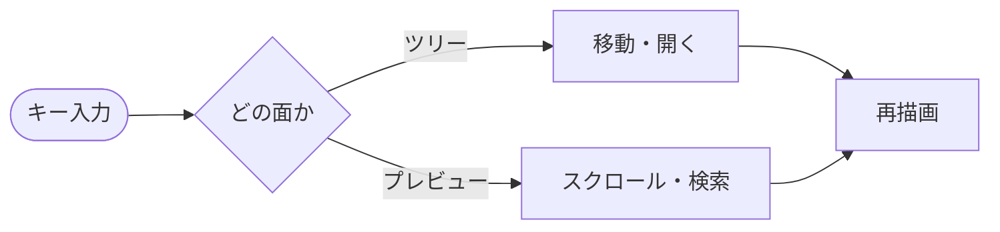
```mermaid
flowchart LR
  K([キー入力]) --> S{どの面か}
  S -->|ツリー| M[移動・開く]
  S -->|プレビュー| P[スクロール・検索]
  M --> R[再描画]
  P --> R
```

### `stateDiagram-v2` — モードと遷移

konoma の UI は 2 つのモードと、その間の行き来だけでできています。`[*]` は開始と終了の印です。
状態の中に状態機械を入れられ、`プレビュー` を囲む枠は入れ子から導かれます（指示ではありません）。

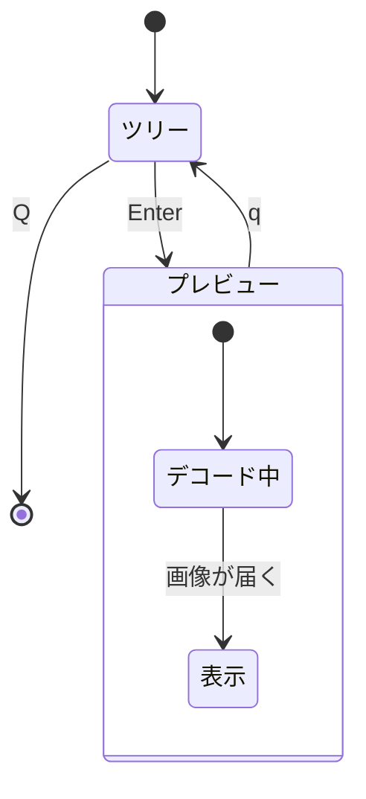
```mermaid
stateDiagram-v2
  [*] --> ツリー
  ツリー --> プレビュー : Enter
  プレビュー --> ツリー : q
  state プレビュー {
    [*] --> デコード中
    デコード中 --> 表示 : 画像が届く
  }
  ツリー --> [*] : Q
```

### `classDiagram` — 型と、その持ちもの

クラスの箱は区画に分かれます。名前・フィールド・メソッドの順で、`+`/`-` が可視性です。
`<|--` が継承、`-->` がただの関連です。

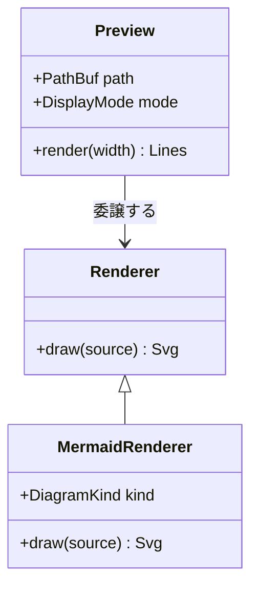
```mermaid
classDiagram
  class Preview {
    +PathBuf path
    +DisplayMode mode
    +render(width) Lines
  }
  class Renderer {
    +draw(source) Svg
  }
  class MermaidRenderer {
    +DiagramKind kind
    +draw(source) Svg
  }
  Preview --> Renderer : 委譲する
  Renderer <|-- MermaidRenderer
```

### `erDiagram` — 実体と、その個数

鳥の足のような記号が要点です。`||` はちょうど 1 つ、`o{` は 0 個以上を表します。実体には型と
`PK`/`FK` を並べた属性表を持たせられます。

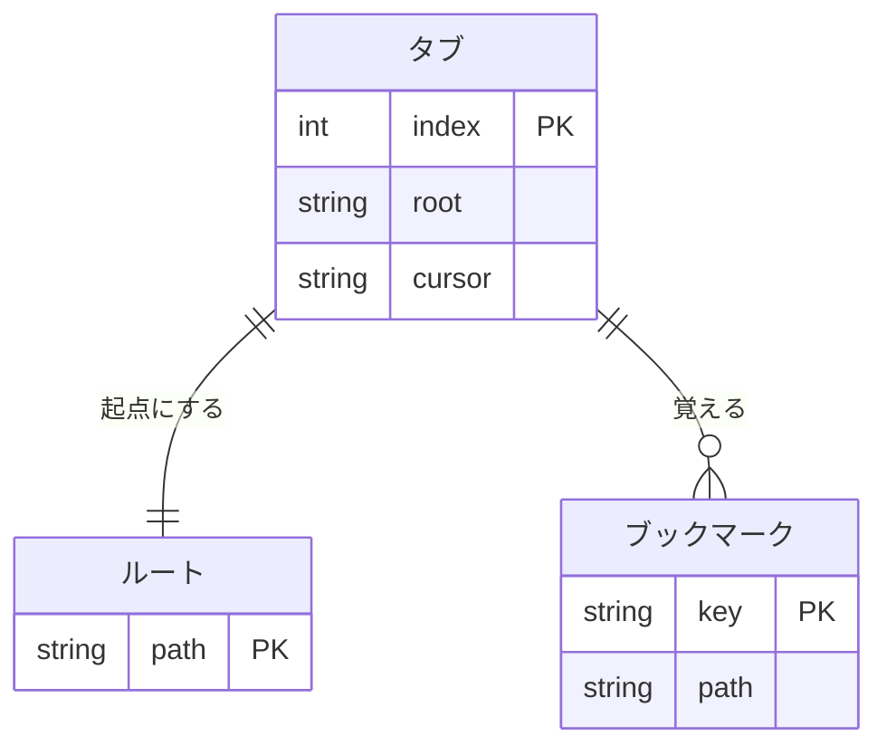
```mermaid
erDiagram
  TAB["タブ"] {
    int index PK
    string root
    string cursor
  }
  MARK["ブックマーク"] {
    string key PK
    string path
  }
  ROOT["ルート"] {
    string path PK
  }
  TAB ||--|| ROOT : 起点にする
  TAB ||--o{ MARK : 覚える
```

## やりとり

### `sequenceDiagram` — 誰が何を、どの順で

時間は上から下へ流れます。棒人間の登場人物、ワーカーが動いている間を示す活性化バー
（`+` … `deactivate`）、端末ごとに分かれる `alt` ブロックを使っています。

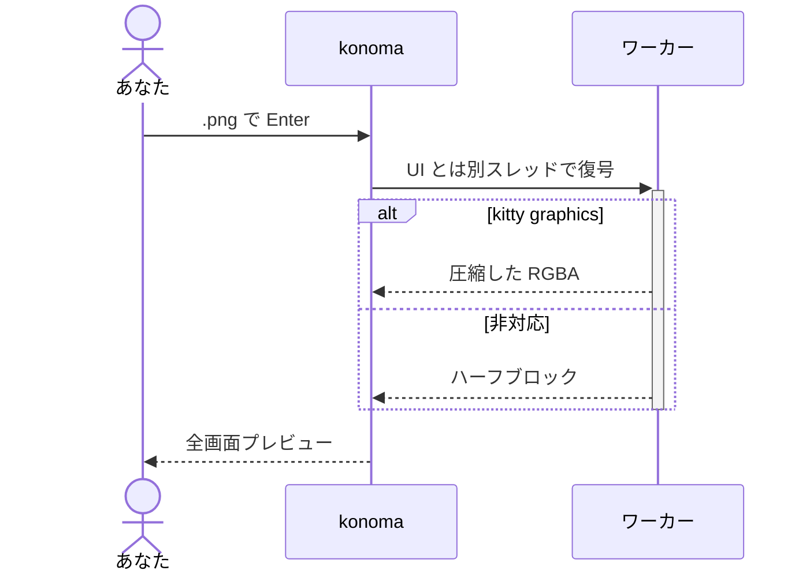
```mermaid
sequenceDiagram
  actor U as あなた
  participant K as konoma
  participant W as ワーカー
  U->>K: .png で Enter
  K->>+W: UI とは別スレッドで復号
  alt kitty graphics
    W-->>K: 圧縮した RGBA
  else 非対応
    W-->>K: ハーフブロック
  end
  deactivate W
  K-->>U: 全画面プレビュー
```

### `zenuml` — 同じ話を、コードのように書く

ZenUML は矢印ではなく入れ子の呼び出しとしてやりとりを書きます。`{ … }` の中は呼ばれた側の仕事で、
`if`/`else` はプログラムそのままの読み方になります。

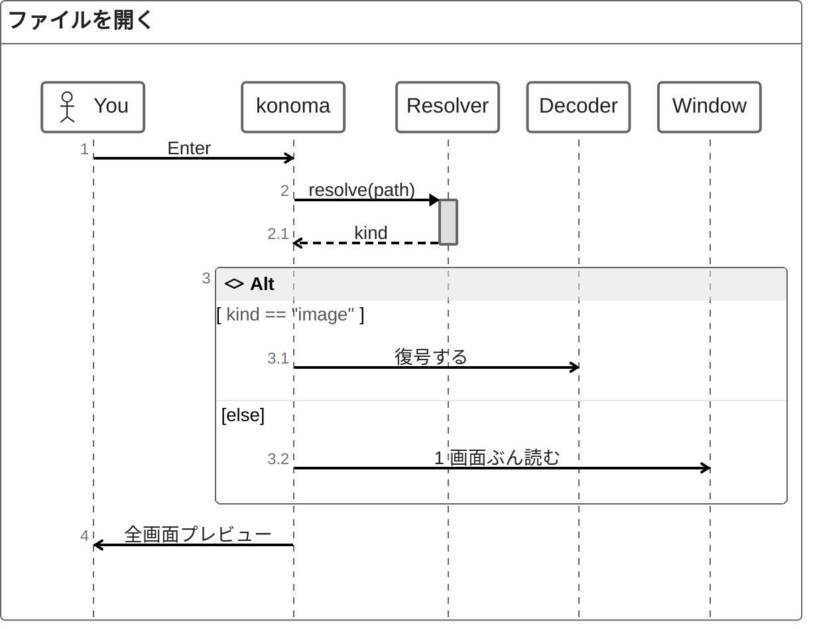
```mermaid
zenuml
  title ファイルを開く
  @Actor You
  You->konoma: Enter
  konoma->Resolver.resolve(path) {
    return kind
  }
  if(kind == "image") {
    konoma->Decoder: 復号する
  } else {
    konoma->Window: 1 画面ぶん読む
  }
  konoma->You: 全画面プレビュー
```

## 木と board

### `mindmap` — 1 つの考えから枝分かれ

字下げだけで書きます。konoma は放射状ではなく左から右へ並べます。放射状だと端末ではラベルの半分が
線の反対側に来て読めなくなるからです。

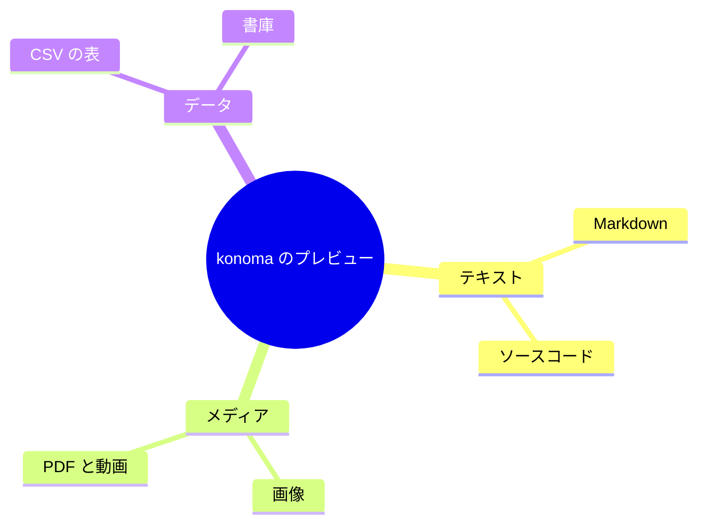
```mermaid
mindmap
  root((konoma のプレビュー))
    テキスト
      Markdown
      ソースコード
    メディア
      画像
      PDF と動画
    データ
      CSV の表
      書庫
```

### `kanban` — カードの並ぶ列

字下げの 1 段目が列、2 段目がカードです。`@{ … }` でカードに担当・優先度・チケットを付けられます。

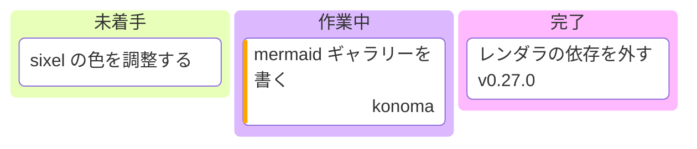
```mermaid
kanban
  未着手
    k1[sixel の色を調整する]
  作業中
    k2[mermaid ギャラリーを書く]@{ assigned: 'konoma', priority: 'High' }
  完了
    k3[レンダラの依存を外す]@{ ticket: 'v0.27.0' }
```

## 時間

### `journey` — その作業が実際どう感じられたか

各手順に 1〜5 の点数が付き、顔として描かれます。点数のあとに関わった人が並びます。
`section` が 1 日を帯に区切ります。

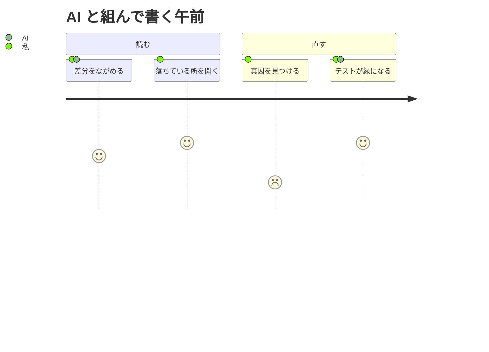
```mermaid
journey
  title AI と組んで書く午前
  section 読む
    差分をながめる: 4: 私, AI
    落ちている所を開く: 5: 私
  section 直す
    真因を見つける: 2: 私
    テストが緑になる: 5: 私, AI
```

### `timeline` — 何がいつ起きたか

左に期間、右に出来事。`section` で帯に分けます。1 つの期間に `:` 区切りで複数の出来事を書けます。

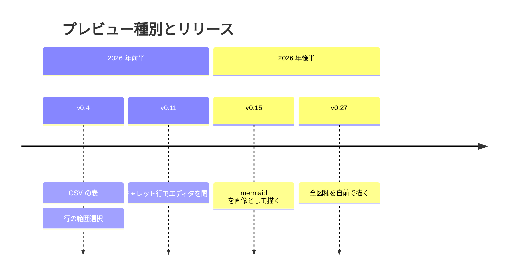
```mermaid
timeline
  title プレビュー種別とリリース
  section 2026 年前半
    v0.4 : CSV の表 : 行の範囲選択
    v0.11 : キャレット行でエディタを開く
  section 2026 年後半
    v0.15 : mermaid を画像として描く
    v0.27 : 全図種を自前で描く
```

### `gantt` — 暦に対する棒

`section` の帯、前の棒の終わりに繋ぐ `after` の依存、`crit` タグ、棒ではなくひし形で描かれる
`milestone` に注目してください。

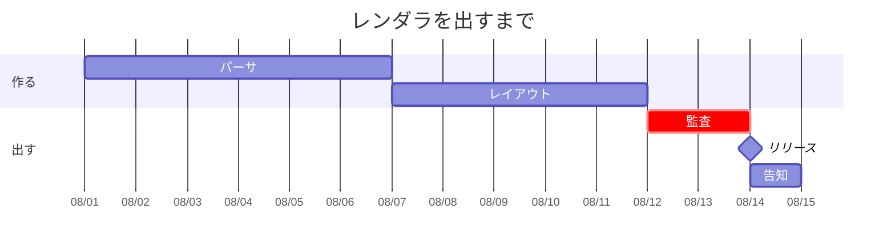
```mermaid
gantt
  title レンダラを出すまで
  dateFormat YYYY-MM-DD
  axisFormat %m/%d
  section 作る
    パーサ     :p1, 2026-08-01, 6d
    レイアウト :after p1, 5d
  section 出す
    監査       :crit, a1, 2026-08-12, 2d
    リリース   :milestone, m1, after a1, 0d
    告知       :after m1, 1d
```

## 構造

### `requirementDiagram` — 満たすべきことと、それを示すもの

要件は id・本文・リスク・検証方法を持ち、element がそれを満たす／検証する側です。

```mermaid
requirementDiagram
  requirement 描画は止まらない {
    id: 1
    text: 再描画は必ず 60ms 以内に終わる
    risk: high
    verifymethod: test
  }
  element 速度テスト {
    type: simulation
  }
  速度テスト - verifies -> 描画は止まらない
```

### `gitGraph` — 枝と合流

コミットがレーンに並び、`branch` で枝が増え、`checkout` で移り、`merge` で戻ります。
タグは対象のコミットの脇に出ます。

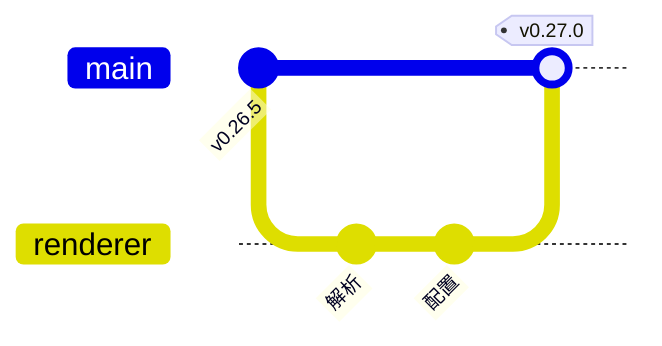
```mermaid
gitGraph
  commit id: "v0.26.5"
  branch renderer
  commit id: "解析"
  commit id: "配置"
  checkout main
  merge renderer tag: "v0.27.0"
```

### `C4Context` — 人・システム・境界

C4 の語彙です。`Person`（人）、自分たちの `System`、外部の `System_Ext`、そして自分たちの範囲を
囲む境界。関連には技術名を 2 つ目のラベルとして添えられます。

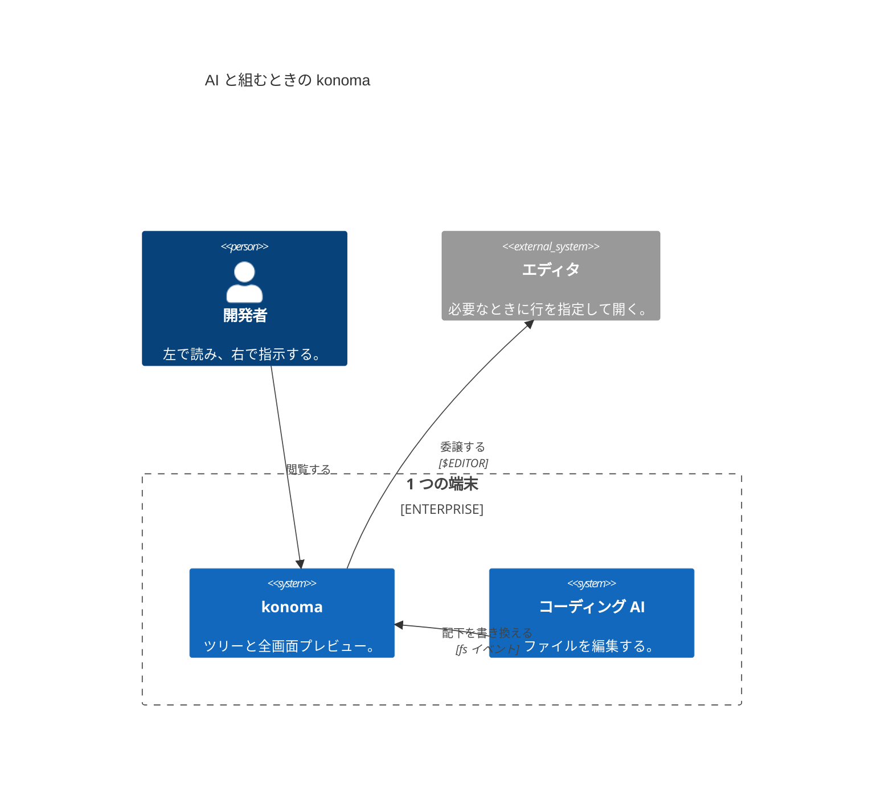
```mermaid
C4Context
  title AI と組むときの konoma
  Person(dev, "開発者", "左で読み、右で指示する。")
  Enterprise_Boundary(term, "1 つの端末") {
    System(konoma, "konoma", "ツリーと全画面プレビュー。")
    System(agent, "コーディング AI", "ファイルを編集する。")
  }
  System_Ext(editor, "エディタ", "必要なときに行を指定して開く。")
  Rel(dev, konoma, "閲覧する")
  Rel(agent, konoma, "配下を書き換える", "fs イベント")
  Rel(konoma, editor, "委譲する", "$EDITOR")
```

### `block-beta` — 置き場所としての格子

flowchart と違い、形を決めるのは `columns` です。1 行に入る枡の数を指定し、`:n` で横に広げ、
`block:` の枠で枡の中にさらに格子を入れます。

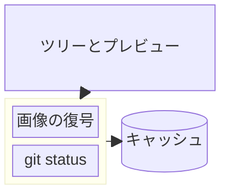
```mermaid
block-beta
  columns 2
  ui["ツリーとプレビュー"]:2
  block:workers:1
    columns 1
    img["画像の復号"]
    git["git status"]
  end
  cache[("キャッシュ")]
  ui --> workers
  workers --> cache
```

### `architecture-beta` — サービスと、線が出る辺

辺ごとにどちら側から出てどちら側に入るかを書きます（`R` 右・`L` 左・`T` 上・`B` 下）。
推測ではなく指定された絵になります。

```mermaid
architecture-beta
  group term(cloud)[端末]
    service tree(server)[ツリー] in term
    service prev(server)[プレビュー] in term
  service repo(database)[git リポジトリ]
  service cache(disk)[画像キャッシュ]
  tree:R --> L:prev
  tree:B --> T:repo
  prev:B --> T:cache
```

## データ

### `pie` — 全体に対する割合

`showData` を付けると、割合に加えて元の数値もラベルの脇に出ます。

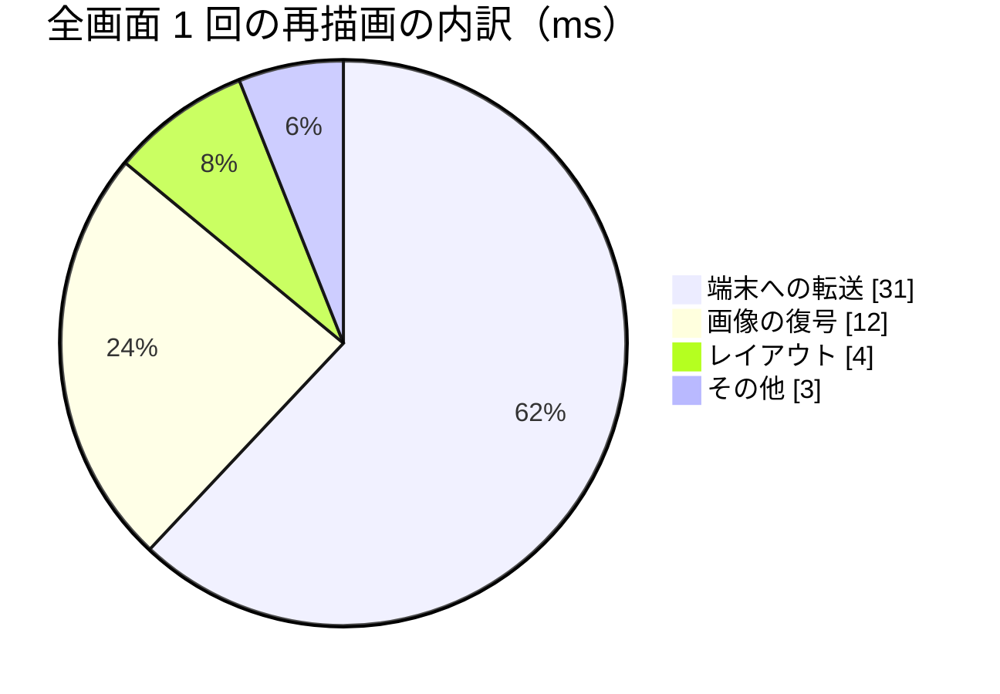
```mermaid
pie showData
  title 全画面 1 回の再描画の内訳（ms）
  "端末への転送" : 31
  "画像の復号" : 12
  "レイアウト" : 4
  "その他" : 3
```

### `xychart-beta` — 同じ軸に棒と折れ線

1 つの x 軸に 2 系列。実測を棒で、目標を折れ線で重ねています。

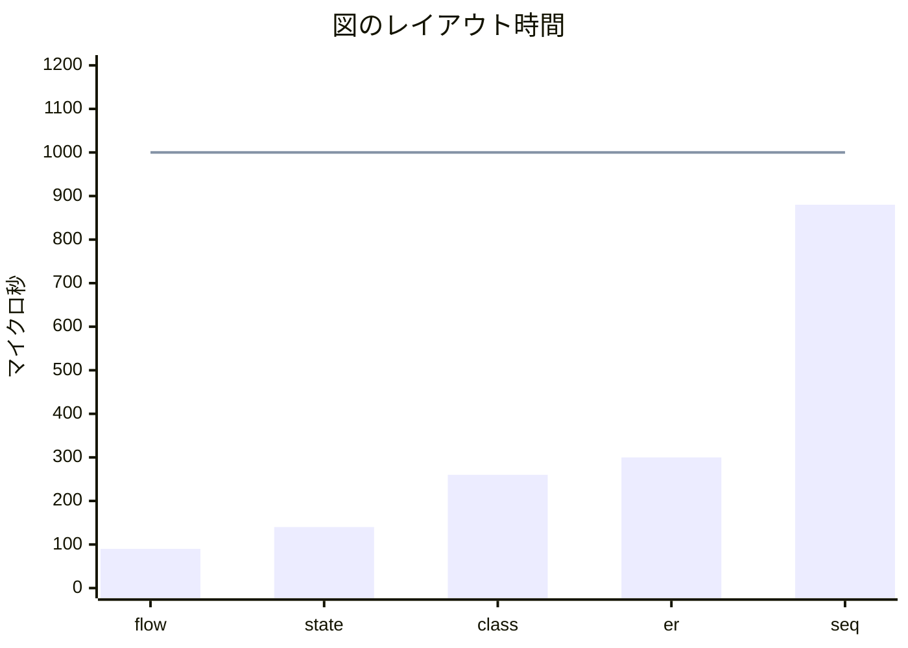
```mermaid
xychart-beta
  title "図のレイアウト時間"
  x-axis [flow, state, class, er, seq]
  y-axis "マイクロ秒" 0 --> 1200
  bar "実測" [90, 140, 260, 300, 880]
  line "目標" [1000, 1000, 1000, 1000, 1000]
```

### `quadrantChart` — 2 軸 4 象限

点は `[x, y]` で単位正方形の中に置かれ、各象限に名前が付きます。

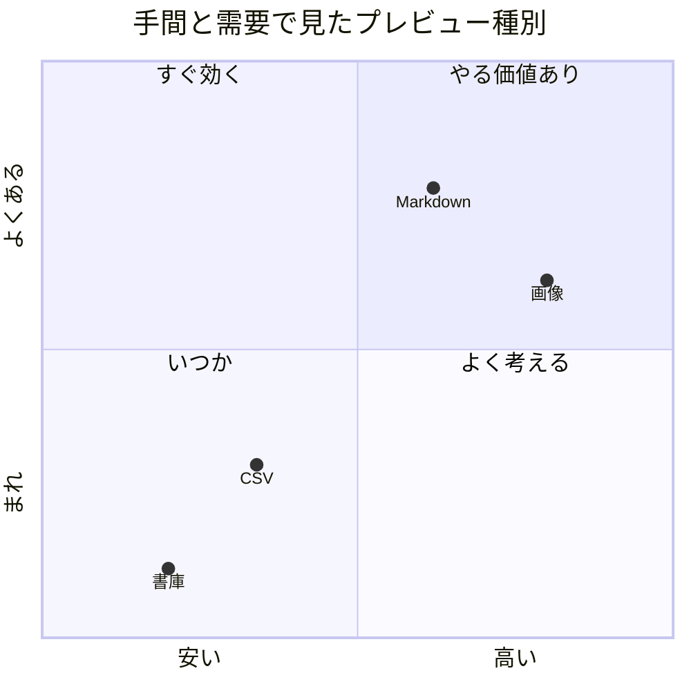
```mermaid
quadrantChart
  title 手間と需要で見たプレビュー種別
  x-axis 安い --> 高い
  y-axis まれ --> よくある
  quadrant-1 やる価値あり
  quadrant-2 すぐ効く
  quadrant-3 いつか
  quadrant-4 よく考える
  Markdown: [0.62, 0.78]
  画像: [0.8, 0.62]
  CSV: [0.34, 0.3]
  書庫: [0.2, 0.12]
```

### `radar-beta` — 同じ軸で複数を比べる

軸を共有して、対象ごとに閉じた曲線を 1 本ずつ。形そのものが比較になります。

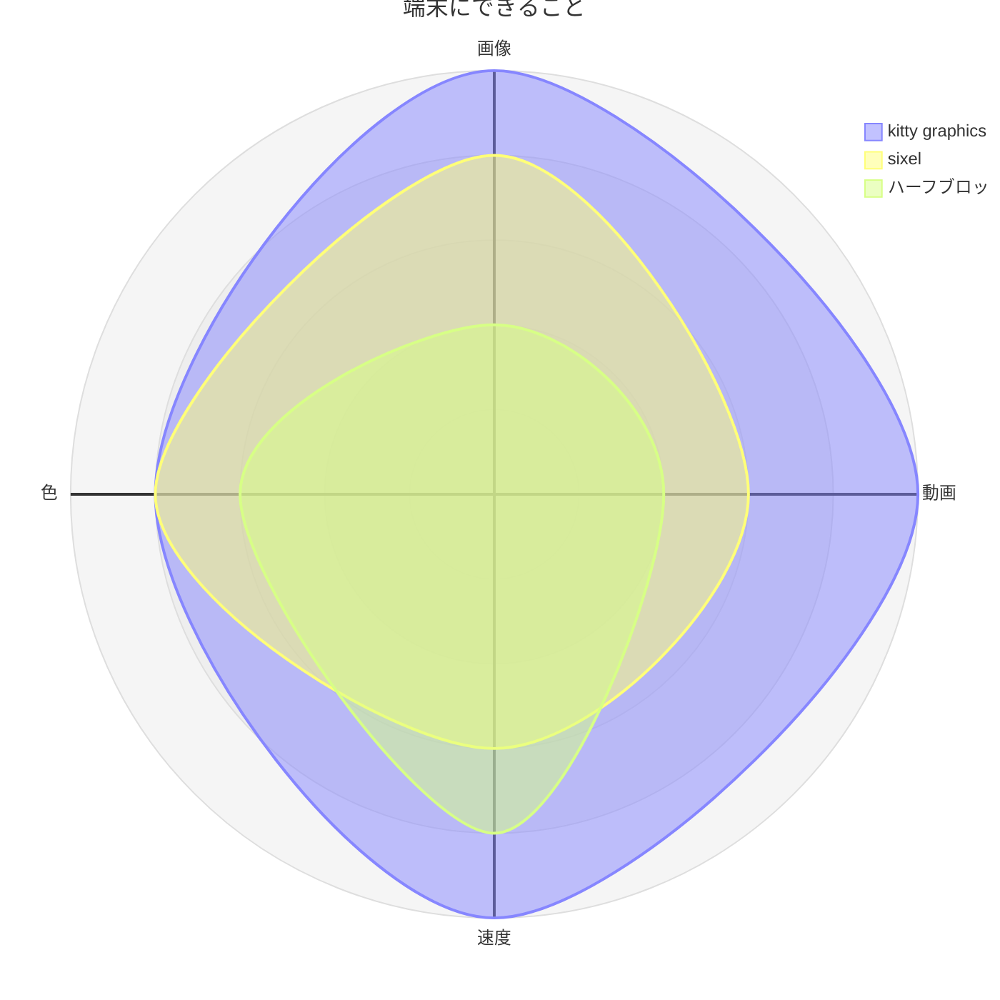
```mermaid
radar-beta
  title 端末にできること
  axis img["画像"], vid["動画"], spd["速度"], col["色"]
  curve k["kitty graphics"]{5, 5, 5, 4}
  curve s["sixel"]{4, 3, 3, 4}
  curve h["ハーフブロック"]{2, 2, 4, 3}
  max 5
  min 0
```

### `treemap-beta` — 値の大きさが面積になる入れ子の箱

面積が数値です。字下げで入れ子になり、節の箱は葉の合計ぶんの大きさになります。

```mermaid
treemap-beta
"src"
  "preview": 21
  "app": 14
"docs"
  "PRD": 9
  "STATUS": 5
```

### `packet-beta` — ビット位置で並ぶフィールド

範囲はビットの位置なので、幅の広いフィールドは本当に広く描かれます。これは konoma が
サムネイルのキャッシュの先頭に書くヘッダです。

```mermaid
packet-beta
0-7: "マジック"
8-11: "版"
12-15: "フラグ"
16-47: "本体の長さ"
48-63: "チェックサム"
```

### `sankey-beta` — 分かれても幅を保つ流れ

`source,target,value` をカンマ区切りで書きます。流れが分かれても帯の幅は比例したままです。

```mermaid
sankey-beta
リポジトリ,テキスト,62
リポジトリ,メディア,21
テキスト,Markdown プレビュー,38
テキスト,コードプレビュー,24
メディア,画像プレビュー,15
メディア,動画サムネイル,6
```

## 単体の `.mmd` ファイル

中身が図だけのファイルは別の経路を通り、インラインではなく 1 枚の全画面の絵として開きます。
このディレクトリには [`flowchart.mmd`](flowchart.mmd)・[`sequence.mmd`](sequence.mmd)・
[`gantt.mmd`](gantt.mmd)・[`architecture.mmd`](architecture.mmd)・[`pie.mmd`](pie.mmd) があります。

描けない図（konoma が知らない種別、構文の誤り）のときは、勝手に何かを描くことはしません。
ソースがそのままテキストとして表示されます。
