# Mermaid gallery

konoma parses, lays out and draws every one of these diagrams itself — no browser, no Node, no
external renderer. Each fence below is a real diagram; press `Tab` to focus one and `Enter` to
open it full screen (`+`/`-` to zoom, `hjkl` to pan, `q` to come back).

The diagrams are deliberately small. A sample that needs scrolling to make sense is a bad sample,
and a terminal pane is 80–200 columns wide.

## Graphs

### `flowchart` — boxes and arrows

The workhorse: three quarters of the mermaid in the wild is this one kind. Notice the direction
(`LR`), the stadium and diamond shapes, and the labels riding on the arrows.

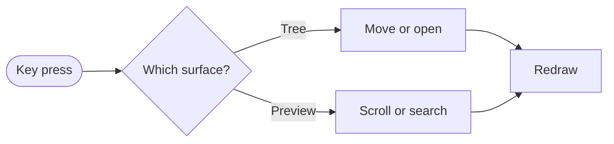
```mermaid
flowchart LR
  K([Key press]) --> S{Which surface?}
  S -->|Tree| M[Move or open]
  S -->|Preview| P[Scroll or search]
  M --> R[Redraw]
  P --> R
```

### `stateDiagram-v2` — modes and transitions

konoma's whole UI is two modes and the moves between them. `[*]` is the start and end marker, and
a state can contain a state machine of its own — the frame around `Preview` is drawn from the
nesting, not from a hint.

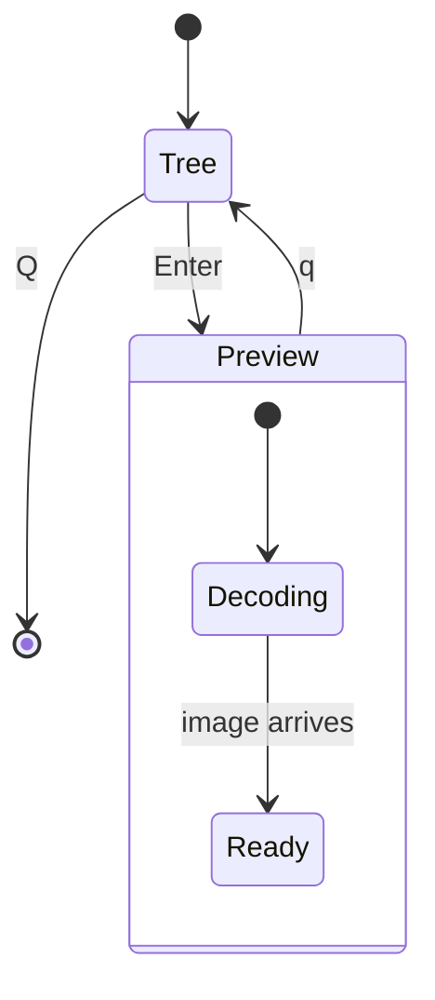
```mermaid
stateDiagram-v2
  [*] --> Tree
  Tree --> Preview : Enter
  Preview --> Tree : q
  state Preview {
    [*] --> Decoding
    Decoding --> Ready : image arrives
  }
  Tree --> [*] : Q
```

### `classDiagram` — types and what they know

A class box has compartments: the name, then fields, then methods, with `+`/`-` for visibility.
`<|--` is inheritance and `-->` a plain association.

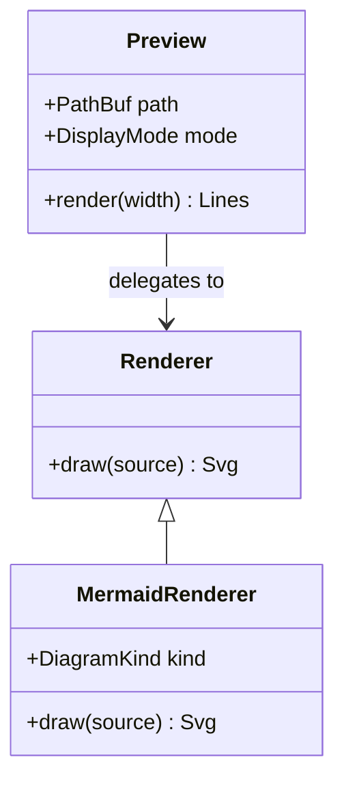
```mermaid
classDiagram
  class Preview {
    +PathBuf path
    +DisplayMode mode
    +render(width) Lines
  }
  class Renderer {
    +draw(source) Svg
  }
  class MermaidRenderer {
    +DiagramKind kind
    +draw(source) Svg
  }
  Preview --> Renderer : delegates to
  Renderer <|-- MermaidRenderer
```

### `erDiagram` — entities and how many of each

The crow's-foot marks are the point: `||` is exactly one, `o{` is zero or more. An entity can
carry an attribute block with types and `PK`/`FK` keys.

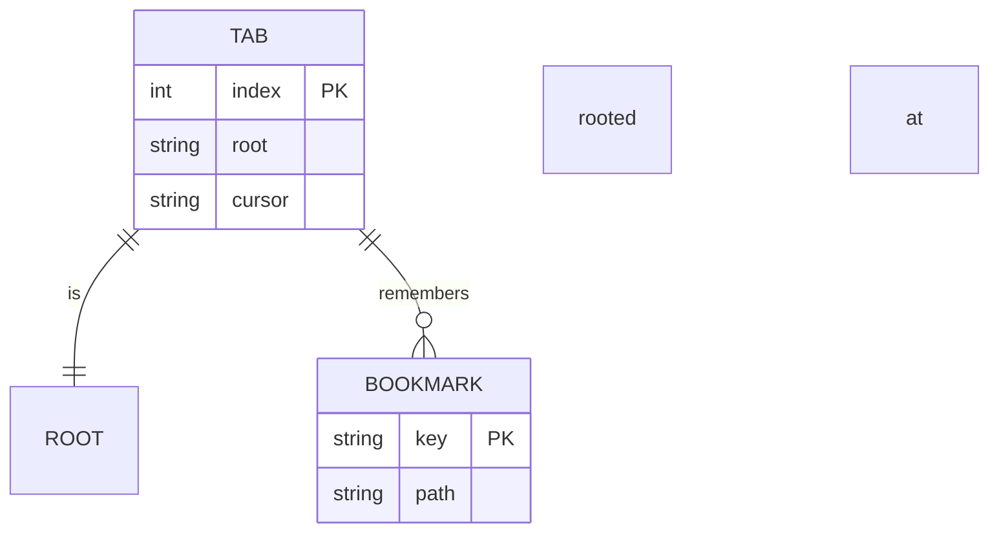
```mermaid
erDiagram
  TAB ||--|| ROOT : is rooted at
  TAB ||--o{ BOOKMARK : remembers
  TAB {
    int index PK
    string root
    string cursor
  }
  BOOKMARK {
    string key PK
    string path
  }
```

## Interactions

### `sequenceDiagram` — who says what, in order

Time runs down the page. This one uses an actor, an activation bar (`+` … `deactivate`) showing
the worker thread being busy, and an `alt` block for the branch every terminal takes differently.

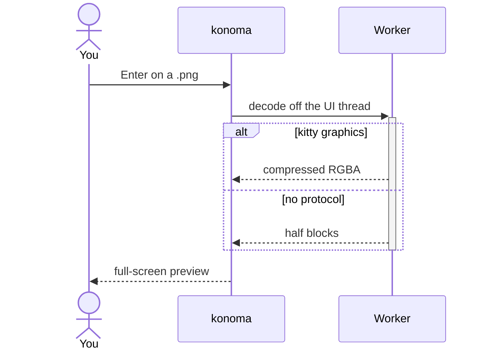
```mermaid
sequenceDiagram
  actor You
  participant K as konoma
  participant W as Worker
  You->>K: Enter on a .png
  K->>+W: decode off the UI thread
  alt kitty graphics
    W-->>K: compressed RGBA
  else no protocol
    W-->>K: half blocks
  end
  deactivate W
  K-->>You: full-screen preview
```

### `zenuml` — the same story, written as code

ZenUML describes an interaction as nested calls rather than as arrows. A block with `{ … }` is
the callee doing work, and `if`/`else` reads as it would in a program.

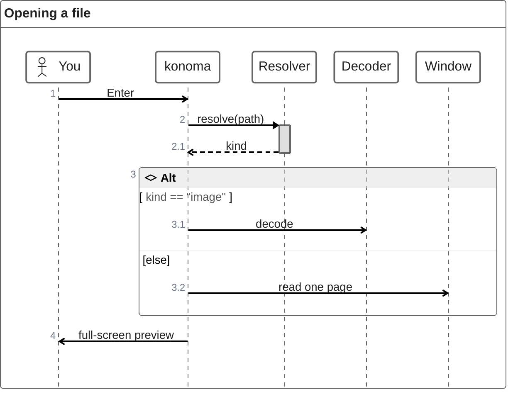
```mermaid
zenuml
  title Opening a file
  @Actor You
  You->konoma: Enter
  konoma->Resolver.resolve(path) {
    return kind
  }
  if(kind == "image") {
    konoma->Decoder: decode
  } else {
    konoma->Window: read one page
  }
  konoma->You: full-screen preview
```

## Trees and boards

### `mindmap` — one idea, branching

Written as indentation alone. konoma lays a mindmap out left to right rather than radially,
because a radial layout puts half the labels on the wrong side of the line in a terminal.

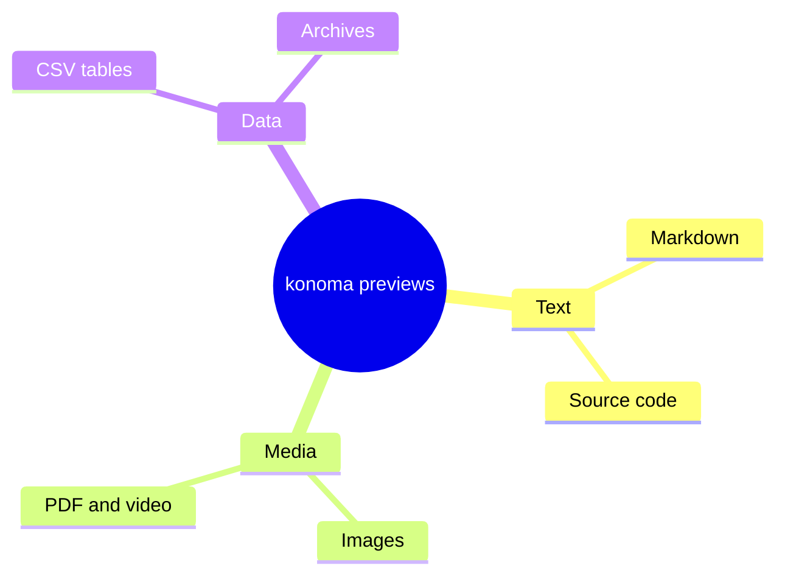
```mermaid
mindmap
  root((konoma previews))
    Text
      Markdown
      Source code
    Media
      Images
      PDF and video
    Data
      CSV tables
      Archives
```

### `kanban` — columns of cards

Columns come from the first indent level, cards from the second. `@{ … }` attaches metadata to a
card — assignee, priority, ticket.

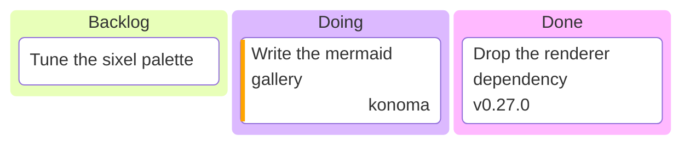
```mermaid
kanban
  Backlog
    k1[Tune the sixel palette]
  Doing
    k2[Write the mermaid gallery]@{ assigned: 'konoma', priority: 'High' }
  Done
    k3[Drop the renderer dependency]@{ ticket: 'v0.27.0' }
```

## Time

### `journey` — how a task actually feels

Each step gets a score from 1 to 5, drawn as a face, and the people involved after the score.
Sections band the day.

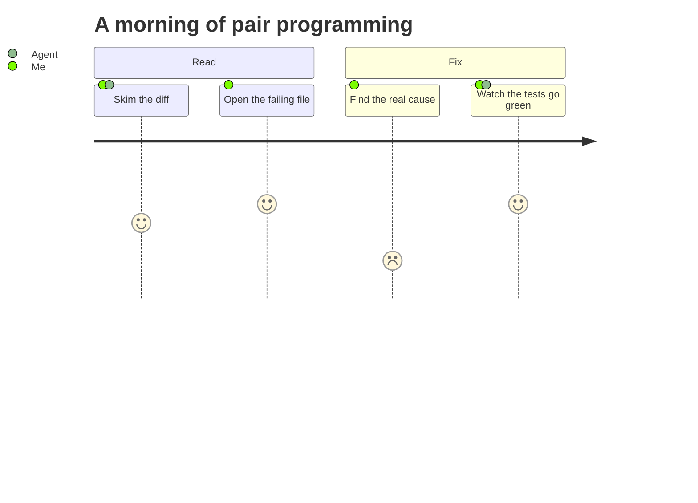
```mermaid
journey
  title A morning of pair programming
  section Read
    Skim the diff: 4: Me, Agent
    Open the failing file: 5: Me
  section Fix
    Find the real cause: 2: Me
    Watch the tests go green: 5: Me, Agent
```

### `timeline` — what happened when

Periods on the left, events on the right; `section` bands them. A period can carry several events
separated by `:`.

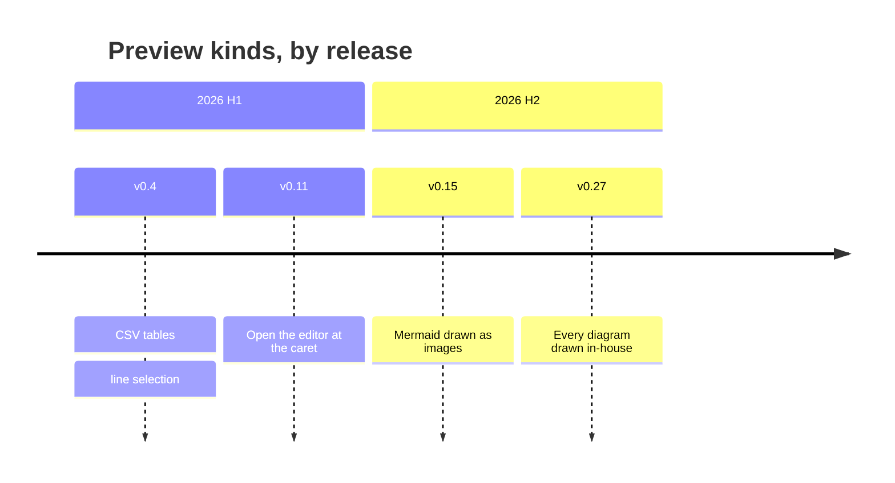
```mermaid
timeline
  title Preview kinds, by release
  section 2026 H1
    v0.4 : CSV tables : line selection
    v0.11 : Open the editor at the caret
  section 2026 H2
    v0.15 : Mermaid drawn as images
    v0.27 : Every diagram drawn in-house
```

### `gantt` — bars against a calendar

Note the `section` bands, the `after` dependency that chains one bar to the end of another, the
`crit` tag, and the `milestone` drawn as a diamond rather than a bar.

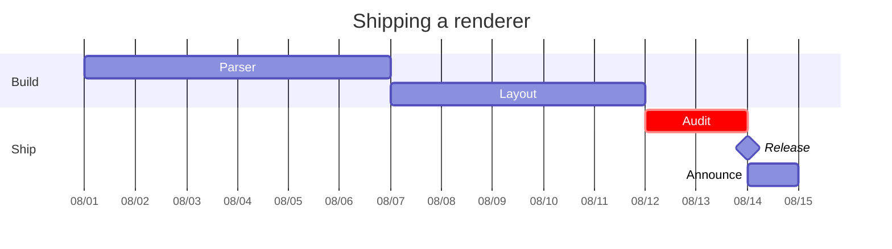
```mermaid
gantt
  title Shipping a renderer
  dateFormat YYYY-MM-DD
  axisFormat %m/%d
  section Build
    Parser        :p1, 2026-08-01, 6d
    Layout        :after p1, 5d
  section Ship
    Audit         :crit, a1, 2026-08-12, 2d
    Release       :milestone, m1, after a1, 0d
    Announce      :after m1, 1d
```

## Structure

### `requirementDiagram` — what must hold, and what proves it

A requirement carries an id, a text, a risk and a verification method; an element is the thing
that satisfies or verifies it.

```mermaid
requirementDiagram
  requirement never_blocks {
    id: 1
    text: a redraw always finishes under 60ms
    risk: high
    verifymethod: test
  }
  element speed_tests {
    type: test suite
  }
  speed_tests - verifies -> never_blocks
```

### `gitGraph` — branches and merges

Commits run along a lane; `branch` opens a new one, `checkout` moves between them, and `merge`
brings one back. Tags sit above the commit they mark.

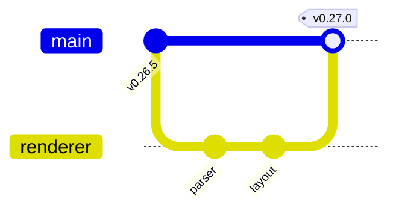
```mermaid
gitGraph
  commit id: "v0.26.5"
  branch renderer
  commit id: "parser"
  commit id: "layout"
  checkout main
  merge renderer tag: "v0.27.0"
```

### `C4Context` — systems, people and boundaries

The C4 vocabulary: a `Person`, a `System` we own, a `System_Ext` we do not, and a boundary drawn
around what is ours. Relations can carry a technology as a second label.

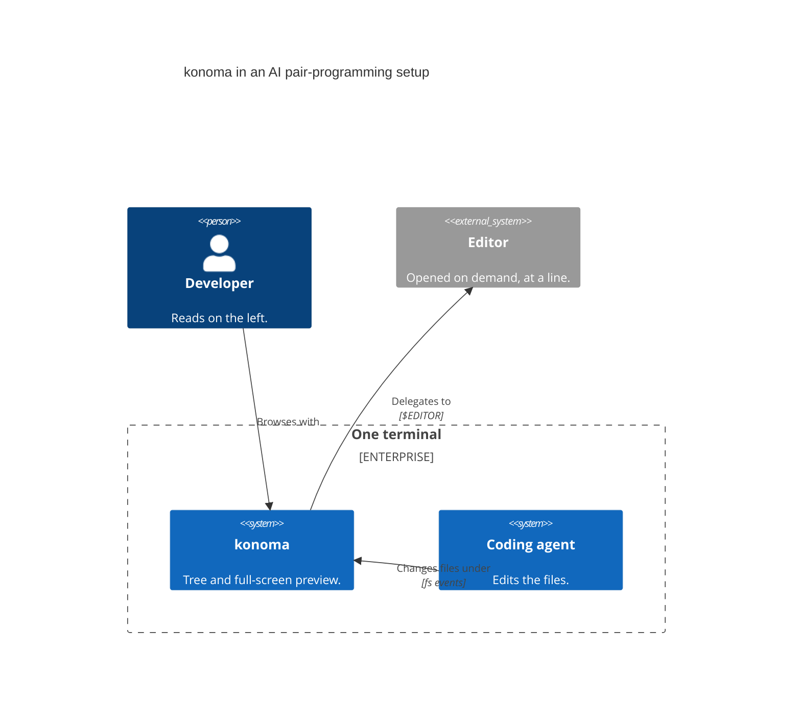
```mermaid
C4Context
  title konoma in an AI pair-programming setup
  Person(dev, "Developer", "Reads on the left.")
  Enterprise_Boundary(term, "One terminal") {
    System(konoma, "konoma", "Tree and full-screen preview.")
    System(agent, "Coding agent", "Edits the files.")
  }
  System_Ext(editor, "Editor", "Opened on demand, at a line.")
  Rel(dev, konoma, "Browses with")
  Rel(agent, konoma, "Changes files under", "fs events")
  Rel(konoma, editor, "Delegates to", "$EDITOR")
```

### `block-beta` — a grid you place things on

Unlike a flowchart, `columns` decides the shape: it says how many cells a row holds, `:n` widens a
block across several, and a `block:` frame nests a grid inside a cell.

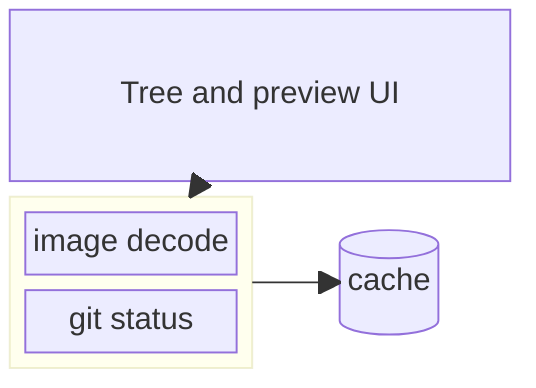
```mermaid
block-beta
  columns 2
  ui["Tree and preview UI"]:2
  block:workers:1
    columns 1
    img["image decode"]
    git["git status"]
  end
  cache[("cache")]
  ui --> workers
  workers --> cache
```

### `architecture-beta` — services, groups and which side a wire leaves from

Every edge names the side it leaves and the side it arrives on (`R` right, `L` left, `T` top,
`B` bottom), so the picture is stated rather than inferred.

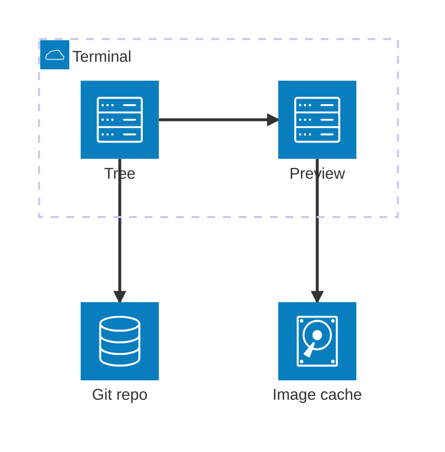
```mermaid
architecture-beta
  group term(cloud)[Terminal]
    service tree(server)[Tree] in term
    service prev(server)[Preview] in term
  service repo(database)[Git repo]
  service cache(disk)[Image cache]
  tree:R --> L:prev
  tree:B --> T:repo
  prev:B --> T:cache
```

## Data

### `pie` — parts of a whole

`showData` prints the raw number beside each label as well as the share.

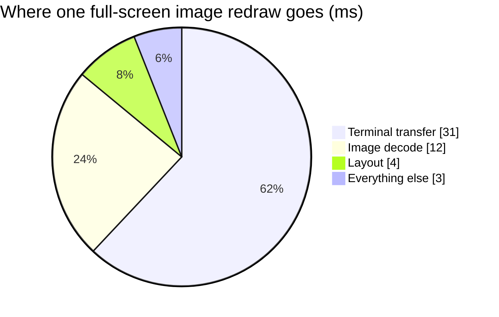
```mermaid
pie showData
  title Where one full-screen image redraw goes (ms)
  "Terminal transfer" : 31
  "Image decode" : 12
  "Layout" : 4
  "Everything else" : 3
```

### `xychart-beta` — bars and lines on the same axes

Two series over one x-axis: a bar for what was measured, a line for what was budgeted.

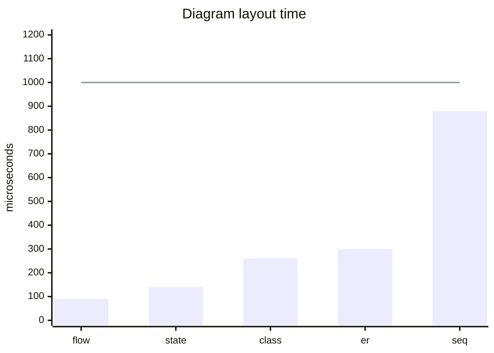
```mermaid
xychart-beta
  title "Diagram layout time"
  x-axis [flow, state, class, er, seq]
  y-axis "microseconds" 0 --> 1200
  bar "measured" [90, 140, 260, 300, 880]
  line "budget" [1000, 1000, 1000, 1000, 1000]
```

### `quadrantChart` — two axes, four verdicts

Points are placed by `[x, y]` in the unit square, and each quadrant gets a name.

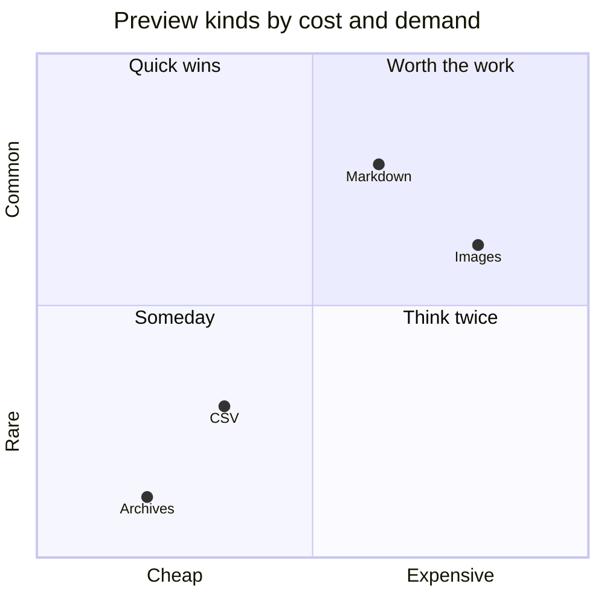
```mermaid
quadrantChart
  title Preview kinds by cost and demand
  x-axis Cheap --> Expensive
  y-axis Rare --> Common
  quadrant-1 Worth the work
  quadrant-2 Quick wins
  quadrant-3 Someday
  quadrant-4 Think twice
  Markdown: [0.62, 0.78]
  Images: [0.8, 0.62]
  CSV: [0.34, 0.3]
  Archives: [0.2, 0.12]
```

### `radar-beta` — several things scored on the same axes

One closed curve per subject over shared axes — the shape is the comparison.

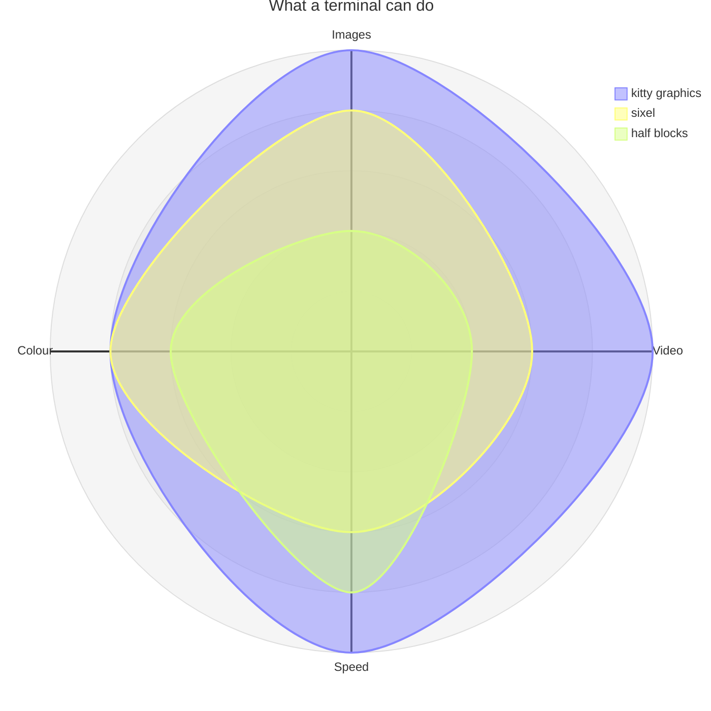
```mermaid
radar-beta
  title What a terminal can do
  axis img["Images"], vid["Video"], spd["Speed"], col["Colour"]
  curve k["kitty graphics"]{5, 5, 5, 4}
  curve s["sixel"]{4, 3, 3, 4}
  curve h["half blocks"]{2, 2, 4, 3}
  max 5
  min 0
```

### `treemap-beta` — nested boxes sized by value

Area is the number. Indentation nests, so a section's box is as big as its leaves put together.

```mermaid
treemap-beta
"src"
  "preview": 21
  "app": 14
"docs"
  "PRD": 9
  "STATUS": 5
```

### `packet-beta` — bit fields laid out in rows

Ranges are bit offsets, so a wide field really is drawn wide. This is the header konoma writes in
front of a cached thumbnail.

```mermaid
packet-beta
0-7: "Magic"
8-11: "Version"
12-15: "Flags"
16-47: "Payload length"
48-63: "Checksum"
```

### `sankey-beta` — flow that splits and keeps its width

Comma-separated `source,target,value`. The band widths stay proportional as the flow divides.

```mermaid
sankey-beta
Repository,Text,62
Repository,Media,21
Text,Markdown preview,38
Text,Code preview,24
Media,Image preview,15
Media,Video thumbnail,6
```

## Standalone `.mmd` files

A whole file that is nothing but a diagram takes a different path: it opens as one full-screen
picture rather than inline. This directory has four of those to try —
[`flowchart.mmd`](flowchart.mmd), [`sequence.mmd`](sequence.mmd), [`gantt.mmd`](gantt.mmd) and
[`architecture.mmd`](architecture.mmd) — plus [`pie.mmd`](pie.mmd).

If a diagram cannot be drawn — a kind konoma does not know, or a syntax error — nothing is
invented: the source is shown as text instead.
