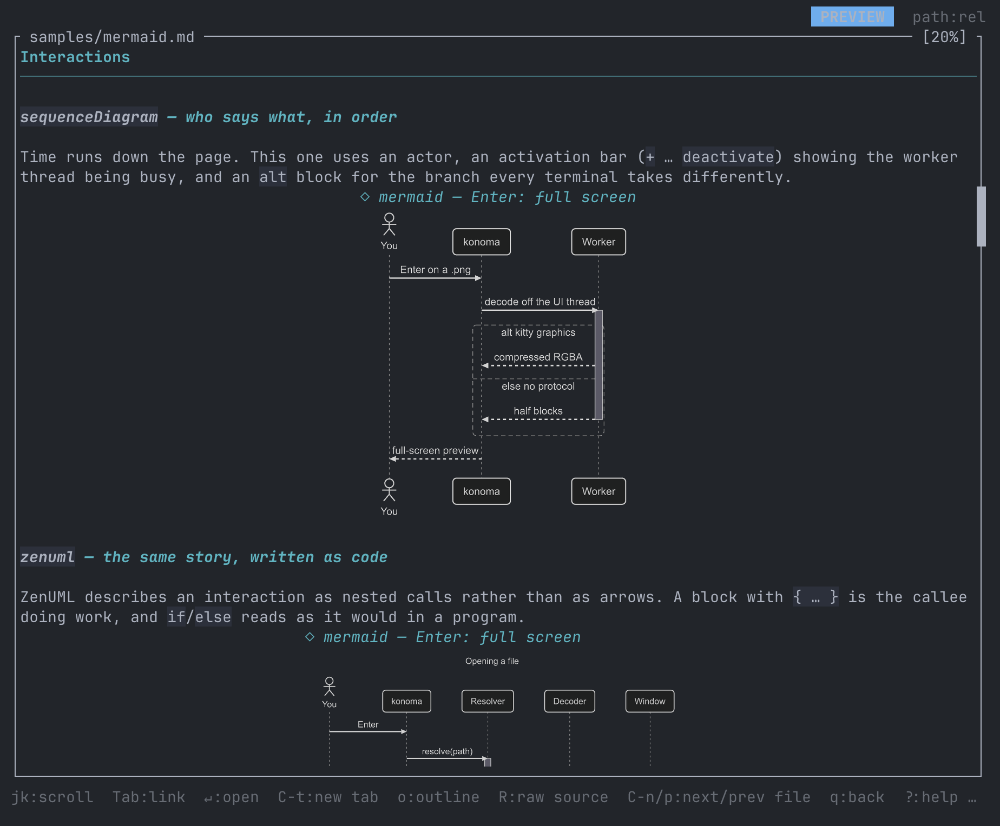

import MermaidCatalogItem from '../../../../components/MermaidCatalogItem.astro';
import manifest from '../../../../assets/mermaid-catalog/ja/manifest.json';

konoma は Mermaid の図を**すべて自分で**解析し、配置し、描いています。ブラウザも
Node も外部レンダラも要りません。Markdown の ```` ```mermaid ```` フェンスは
端末の中で本物の絵になり、単体の `.mmd` ファイルは全画面で開きます。



以下の絵はすべてそのレンダラの出力です。元は
[`samples/mermaid.ja.md`](https://github.com/LESIM-Co-Ltd/konoma/blob/main/samples/mermaid.ja.md)
のフェンスで、設定は出荷時の既定（`ui.mermaid_theme = "dark"`・`ui.mermaid_curve = "basis"`）。
背景は透過です — 端末では自分の背景の上に乗ります。ここでは暗い板の上に置いています。

## 2 つの見え方、設定は 1 行

既定の見え方は **mermaid そのもの**です。何も指定しなければ何も変わりません。
1 行足すと、flowchart と状態図が konoma 自身の直交ルーティングと配色に切り替わります:

```toml
[ui]
mermaid_routing = "konoma-orthogonal"
```

このモードでは辺は直角にしか曲がらず（角も丸めません）、判断のひし形は**面取り矩形**に
なって辺が平らな面に着地し、ランクを貫く直進辺は 1 本のまっすぐなレーンに整列します。
配色も konoma 自身のものになります — 暗いノード塗り・破線のサブグラフ枠・`classDef` /
`style` の色をノードの枠と辺とラベルへ一貫して適用（したがって `ui.mermaid_theme` は
このモードでは効きません）。

効くのは **`flowchart` と `stateDiagram-v2` だけ**です。この 2 種は下で 2 枚ずつ
（konoma-orthogonal を先に、次に既定の `splines`）、残り 21 種は 1 枚ずつ掲載しています
＝ルーティングはそもそも届きません。

Mermaid 関連の設定は[設定リファレンス](../../reference/configuration/)、
ズーム・パン・全画面のキーは[プレビューを使い倒す](../preview/)を参照してください。

## グラフ

### `flowchart` — 箱と矢印

いちばん使われる図種で、実際に見かける mermaid の 4 分の 3 はこれです。向きの指定
（`LR`）、角丸とひし形の形の違い、矢印に乗るラベルに注目してください。

<MermaidCatalogItem lang="ja" item={manifest.items[0]} />

### 色 — `classDef` / `:::` / `style` / `linkStyle`

flowchart は色で「どれが同じ仲間か」を語ります。`classDef` が宣言に名前を付け、
`class`（短縮形は `:::`）がノードに割り当て、`style` は 1 つのノードを直接塗り、
`linkStyle` は**宣言順の添字**で辺を塗ります。

<MermaidCatalogItem lang="ja" item={manifest.items[1]} />

### 大きさ — 図は必要なだけの大きさで描かれる

konoma は図を**周囲の文字と同じ大きさ**で組み、**拡大はしません**。中身の多い図は
本当に横に長いので、その分だけ画面を使います — これは konoma 自身のプレビューの
振り分けで、扱える全形式と、絵が端末に届く 3 通りの経路です。

<MermaidCatalogItem lang="ja" item={manifest.items[2]} />

### `stateDiagram-v2` — モードと遷移

konoma の UI は 2 つのモードと、その間の行き来だけでできています。`[*]` は開始と終了の
印です。状態の中に状態機械を入れられ、枠は入れ子から導かれます（指示ではありません）。

<MermaidCatalogItem lang="ja" item={manifest.items[3]} />

### `classDiagram` — 型と、その持ちもの

クラスの箱は区画に分かれます。名前・フィールド・メソッドの順で、`+`/`-` が可視性です。
`<|--` が継承、`-->` がただの関連です。

<MermaidCatalogItem lang="ja" item={manifest.items[4]} />

### `erDiagram` — 実体と、その個数

鳥の足のような記号が要点です。`||` はちょうど 1 つ、`o{` は 0 個以上を表します。実体には
型と `PK`/`FK` を並べた属性表を持たせられます。

<MermaidCatalogItem lang="ja" item={manifest.items[5]} />

## やりとり

### `sequenceDiagram` — 誰が何を、どの順で

時間は上から下へ流れます。棒人間の登場人物、ワーカーが動いている間を示す活性化バー
（`+` … `deactivate`）、端末ごとに分かれる `alt` ブロックを使っています。

<MermaidCatalogItem lang="ja" item={manifest.items[6]} />

### `zenuml` — 同じ話を、コードのように書く

ZenUML は矢印ではなく入れ子の呼び出しとしてやりとりを書きます。`{ … }` の中は呼ばれた
側の仕事で、`if`/`else` はプログラムそのままの読み方になります。

<MermaidCatalogItem lang="ja" item={manifest.items[7]} />

## 木と board

### `mindmap` — 1 つの考えから枝分かれ

字下げだけで書きます。konoma は放射状ではなく左から右へ並べます。放射状だと端末では
ラベルの半分が線の反対側に来て読めなくなるからです。

<MermaidCatalogItem lang="ja" item={manifest.items[8]} />

### `kanban` — カードの並ぶ列

字下げの 1 段目が列、2 段目がカードです。`@{ … }` でカードに担当・優先度・チケットを
付けられます。

<MermaidCatalogItem lang="ja" item={manifest.items[9]} />

## 時間

### `journey` — その作業が実際どう感じられたか

各手順に 1〜5 の点数が付き、顔として描かれます。点数のあとに関わった人が並びます。
`section` が 1 日を帯に区切ります。

<MermaidCatalogItem lang="ja" item={manifest.items[10]} />

### `timeline` — 何がいつ起きたか

左に期間、右に出来事。`section` で帯に分けます。1 つの期間に `:` 区切りで複数の出来事を
書けます。

<MermaidCatalogItem lang="ja" item={manifest.items[11]} />

### `gantt` — 暦に対する棒

`section` の帯、前の棒の終わりに繋ぐ `after` の依存、`crit` タグ、棒ではなくひし形で
描かれる `milestone` に注目してください。

<MermaidCatalogItem lang="ja" item={manifest.items[12]} />

## 構造

### `requirementDiagram` — 満たすべきことと、それを示すもの

要件は id・本文・リスク・検証方法を持ち、element がそれを満たす／検証する側です。

<MermaidCatalogItem lang="ja" item={manifest.items[13]} />

### `gitGraph` — 枝と合流

コミットがレーンに並び、`branch` で枝が増え、`checkout` で移り、`merge` で戻ります。
タグは対象のコミットの脇に出ます。

<MermaidCatalogItem lang="ja" item={manifest.items[14]} />

### `C4Context` — 人・システム・境界

C4 の語彙です。`Person`（人）、自分たちの `System`、外部の `System_Ext`、そして自分たちの
範囲を囲む境界。関連には技術名を 2 つ目のラベルとして添えられます。

<MermaidCatalogItem lang="ja" item={manifest.items[15]} />

### `block-beta` — 置き場所としての格子

flowchart と違い、形を決めるのは `columns` です。1 行に入る枡の数を指定し、`:n` で横に
広げ、`block:` の枠で枡の中にさらに格子を入れます。

<MermaidCatalogItem lang="ja" item={manifest.items[16]} />

### `architecture-beta` — サービスと、線が出る辺

辺ごとにどちら側から出てどちら側に入るかを書きます（`R` 右・`L` 左・`T` 上・`B` 下）。
推測ではなく指定された絵になります。

<MermaidCatalogItem lang="ja" item={manifest.items[17]} />

## データ

### `pie` — 全体に対する割合

`showData` を付けると、割合に加えて元の数値もラベルの脇に出ます。

<MermaidCatalogItem lang="ja" item={manifest.items[18]} />

### `xychart-beta` — 同じ軸に棒と折れ線

1 つの x 軸に 2 系列。実測を棒で、目標を折れ線で重ねています。

<MermaidCatalogItem lang="ja" item={manifest.items[19]} />

### `quadrantChart` — 2 軸 4 象限

点は `[x, y]` で単位正方形の中に置かれ、各象限に名前が付きます。

<MermaidCatalogItem lang="ja" item={manifest.items[20]} />

### `radar-beta` — 同じ軸で複数を比べる

軸を共有して、対象ごとに閉じた曲線を 1 本ずつ。形そのものが比較になります。

<MermaidCatalogItem lang="ja" item={manifest.items[21]} />

### `treemap-beta` — 値の大きさが面積になる入れ子の箱

面積が数値です。字下げで入れ子になり、節の箱は葉の合計ぶんの大きさになります。

<MermaidCatalogItem lang="ja" item={manifest.items[22]} />

### `packet-beta` — ビット位置で並ぶフィールド

範囲はビットの位置なので、幅の広いフィールドは本当に広く描かれます。

<MermaidCatalogItem lang="ja" item={manifest.items[23]} />

### `sankey-beta` — 分かれても幅を保つ流れ

`source,target,value` をカンマ区切りで書きます。流れが分かれても帯の幅は比例したままです。

<MermaidCatalogItem lang="ja" item={manifest.items[24]} />

## 描けないときは

でっち上げません。konoma が知らない図種や構文エラーは、ソースをテキストとして表示します。
`ui.mermaid = "text"` を指定すれば、常に従来の Unicode 描画になります。
