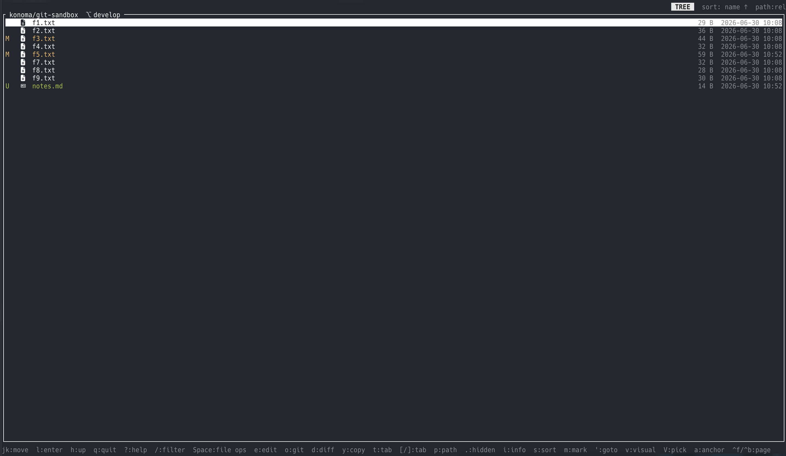
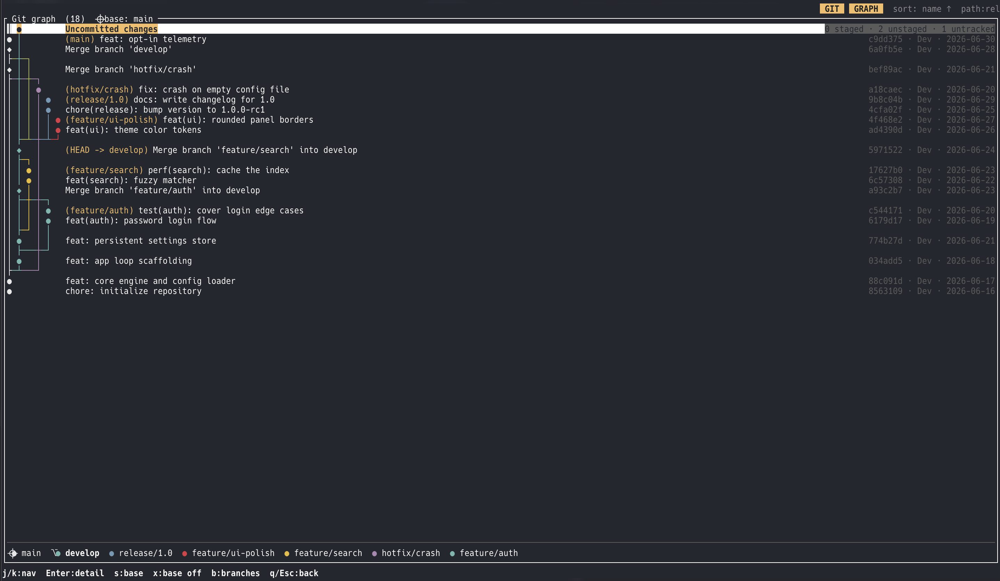
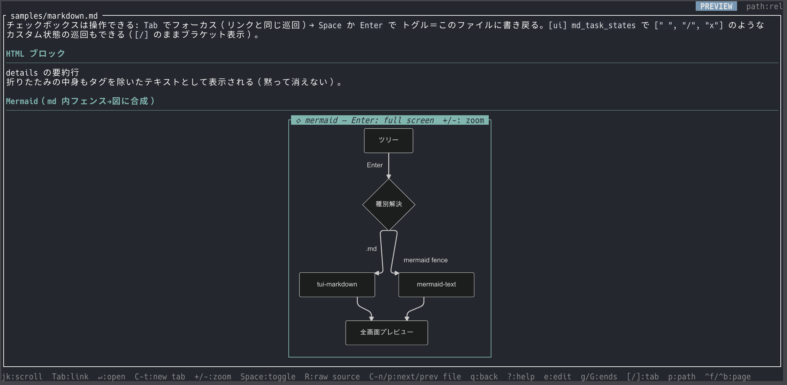

import { Card, CardGrid } from '@astrojs/starlight/components';
import TerminalDemo from '../../../components/TerminalDemo.astro';

<TerminalDemo lang="ja" />

## konoma の特徴

<CardGrid stagger>
	<Card title="全画面プレビュー" icon="document">
		分割ペインはありません。ツリーも全画面、プレビューも全画面、切替は
		キー2つ。Markdown は装飾描画(表・Mermaid 図・インライン画像・操作できる
		チェックボックス)、コードはシンタックスハイライト、CSV は移動できる
		テーブル、画像/PDF/SVG は kitty graphics による実ピクセル表示。
	</Card>
	<Card title="AI ペア開発のために" icon="rocket">
		左に konoma、右にコーディングエージェント。フォローモード(`F`)は
		エージェントが変更したファイルの diff を自動表示し、`C` は未コミット
		変更の一覧、`@path#L12-34` 参照のコピーはキー1つ。会話に貼るだけで
		行単位の指示ができます。
	</Card>
	<Card title="本物の git クライアント" icon="seti:git">
		stage / unstage / コミット・全画面 diff・log・ブランチ・自作レンダラの
		コミットグラフ(角ばった罫線・基準ブランチの固定)まで、ブラウザの中で
		完結します。
	</Card>
	<Card title="設定駆動・安全第一" icon="setting">
		「フォーマット→ビューア」の対応もキーもすべて 1 つの TOML で宣言。
		未知のファイルはクラッシュせず安全な画面に、削除は確認付きでゴミ箱へ、
		壊れた設定でも UI は壊れません。
	</Card>
</CardGrid>

## スクリーンショット







## インストール

```sh
cargo binstall konoma       # プレビルドバイナリ(要 cargo-binstall)
# または
cargo install konoma        # ソースからビルド
```

主対象は macOS (Apple Silicon)です(Intel macOS・Linux x86_64 にもプレビルドあり)。
画像プレビューには kitty graphics 対応端末([Ghostty](https://ghostty.org) など)が
必要です。起動は:

```sh
konoma [DIR]
```

どの画面でも `?` でヘルプが出ます。リポジトリの `samples/tutorial.ja.md` を
**konoma 自身で開く**と、触りながら覚えるチュートリアルが始まります。
